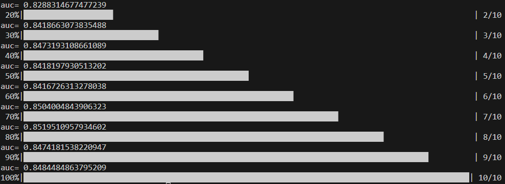
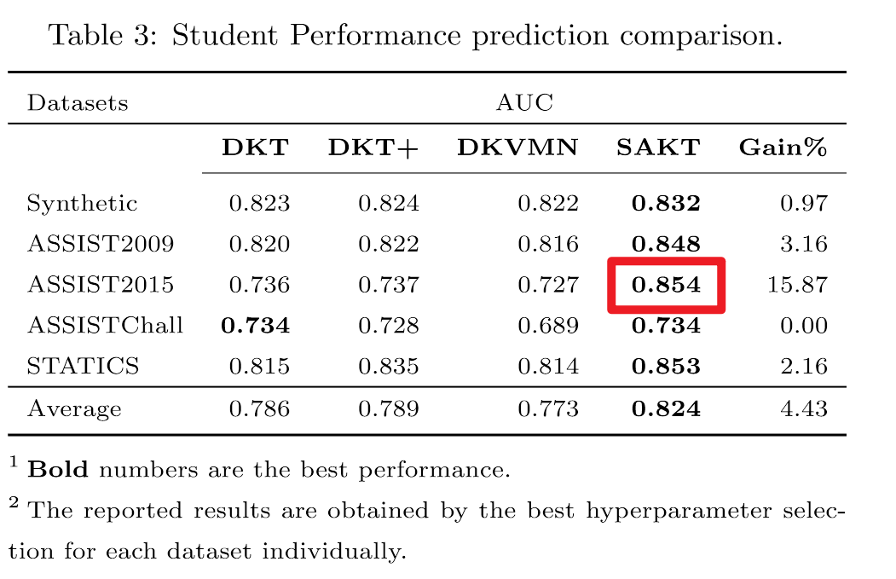
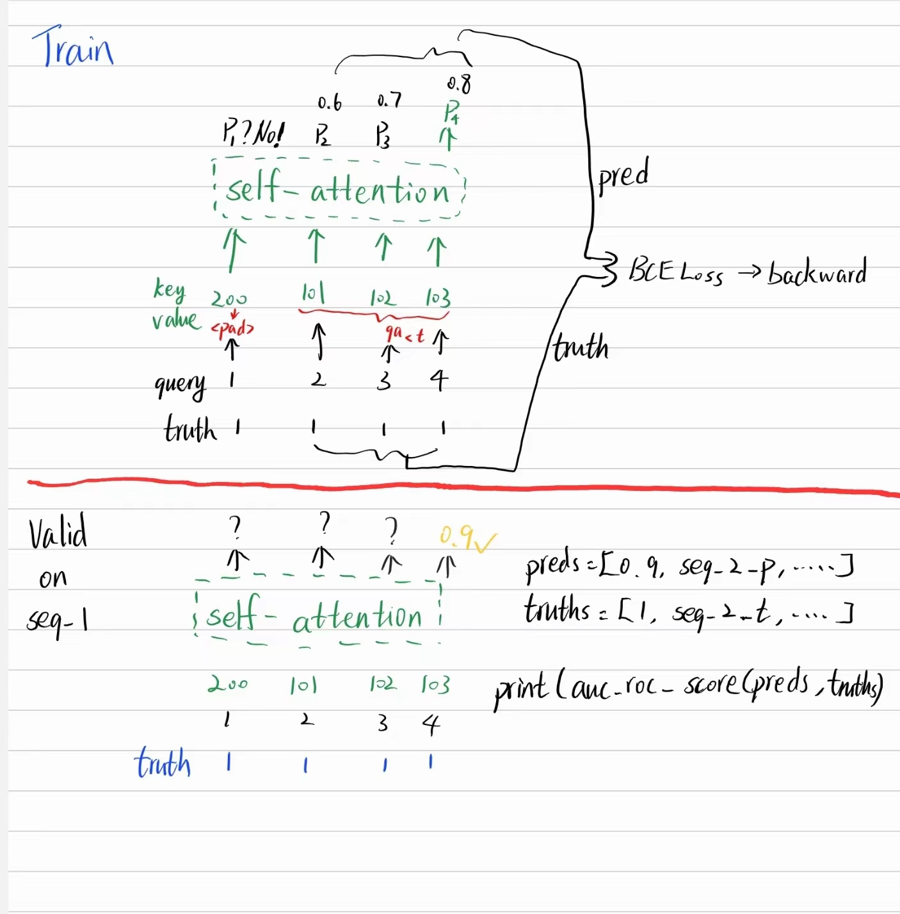
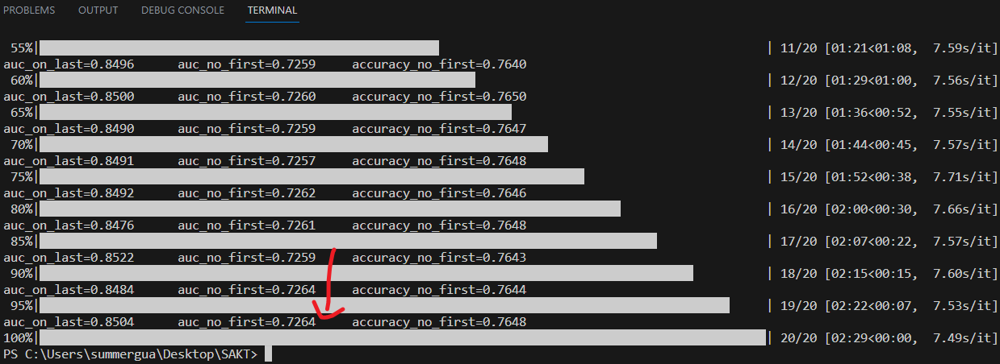
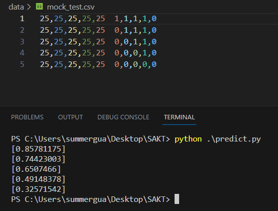
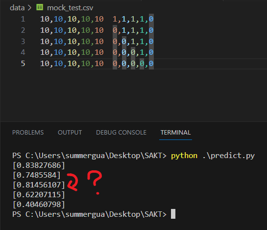
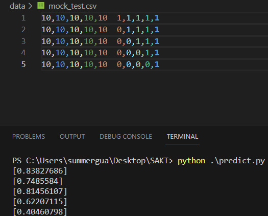

# SAKT Implemented in PyTorch

## Introduction
This project expands the implemention of SAKT model in [deepKT](https://github.com/jdxyw/deepKT) with **better loss calculation and various auc & acc results**.

Results show auc scores calculated with the last answer(y_t) are more closed to that in [SAKT paper](https://arxiv.org/abs/1907.06837). **We think that most students' last answer is `1` leads to very high auc and acc calculated with y_t.**

- train: define hyper-params and run `$python run.py`
- predict: choose your `.csv` file and run `$python predict.py`




## Method of This Project:

Say we have an interaction sequence (n_skill=100):
- concept id: 1,2,3,4
- student response: 1,1,1,1



**We also keep the method in deepKT. See the console.**



## Prediction

Say 5 students finished have 4 exercises corresponding to concept_25 with different answers.
```python
25,25,25,25,25	1,1,1,1,1 # all correct
25,25,25,25,25	0,1,1,1,1
25,25,25,25,25	0,0,1,1,1
25,25,25,25,25	0,0,0,1,1
25,25,25,25,25	0,0,0,0,1 # all wrong
```
Let's predict the 5th answer on concept_25. Prediction value should decrement?



Good. But sometimes fluctuate :( So we should try AKT / SAINT / SAINT+



And the last answer(i.e. the ground truth) won't change the result, which is what we want.


## Reference:

https://github.com/jdxyw/deepKT - main reference
https://github.com/arshadshk/SAKT-pytorch
https://github.com/pykt-team/pykt-toolkit